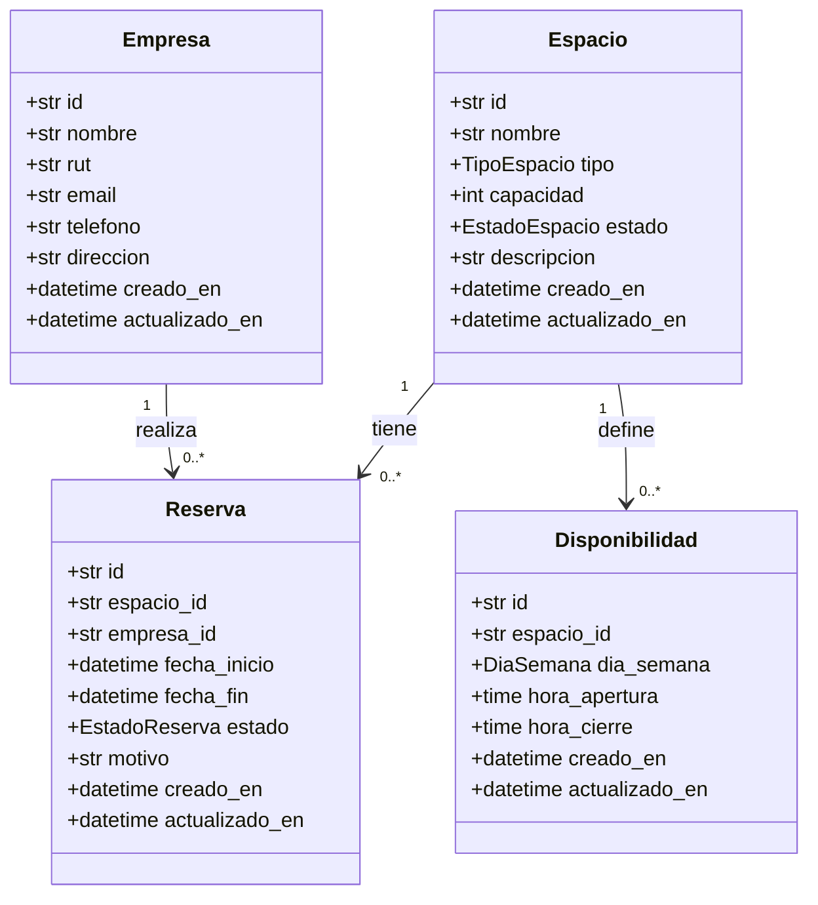

#  Backend 2026 - Grupo 05 | Coworking Reservation API

> **Curso:** Desarrollo de Backend (ICINF1108)  
> **Entrega:** Semana 6 — 14 y 16 de septiembre de 2026  
> **Estado:** 🟢 En desarrollo

[](https://www.python.org/)
[](https://fastapi.tiangolo.com/)
[](https://docs.pydantic.dev/)
[](./LICENSE)

---

##  Resumen Ejecutivo

API REST para la **gestión de reservas de espacios de coworking**, diseñada para resolver los conflictos de duplicidad y superposición de horarios que surgen cuando los administradores utilizan planillas compartidas. Permite administrar espacios, empresas clientas, reservas y disponibilidades horarias, aplicando reglas de negocio reales del dominio.

###  Problemática (P1-P7)

| # | Pregunta | Respuesta |
|---|----------|-----------|
| **P1** | Situación actual | Los administradores de un espacio de coworking registran reservas en una planilla de Google Sheets compartida, generando duplicaciones y conflictos de horario. |
| **P2** | Actores | Administradores del espacio · Empresas/miembros que reservan |
| **P3** | Consecuencias | (1) Dos empresas llegan a la misma sala al mismo tiempo. (2) No existe registro histórico del uso de espacios. |
| **P4** | Información administrada | Espacios, reservas, empresas y disponibilidades horarias. |
| **P5** | Acciones (8+) | CRUD de espacios, empresas, reservas y disponibilidades; verificación de conflictos de horario; consulta filtrada de disponibilidad. |
| **P6** | Exclusiones | Sistema de pagos · Autenticación de usuarios · Notificaciones por email |
| **P7** | Criterios de aceptación | (1) No reservar espacios inactivos. (2) Sin conflictos de horario en un mismo espacio. (3) Una empresa no puede tener dos reservas simultáneas. (4) Fecha fin > fecha inicio. (5) Duración mínima 30 min. |

---

##  Características Principales

-  **12+ endpoints REST** con métodos HTTP correctos y códigos de estado estandarizados.
-  **CRUD completo** para las 4 entidades del dominio.
-  **3 reglas de negocio** validadas en el servicio (no solo en el schema).
-  **6+ validaciones** de datos (longitud, numérica, enum, formato, existencia, regla de negocio).
-  **Filtrado + Ordenamiento + Paginación** en un mismo endpoint GET.
-  **Arquitectura en capas**: routers → services → repositories, con separación clara de responsabilidades.
-  **Manejo uniforme de errores** con estructura JSON consistente.
-  **Documentación automática** con Swagger/OpenAPI.
-  **Almacenamiento en memoria** (listas/diccionarios), sin dependencias de BD.

---

##  Stack Tecnológico

| Capa | Tecnología | Versión |
|------|------------|---------|
| Lenguaje | Python | 3.11+ |
| Framework | FastAPI | 0.110+ |
| Validación | Pydantic | 2.x |
| Servidor | Uvicorn | 0.27+ |
| Documentación | Swagger UI / OpenAPI | Automático |
| Pruebas | Thunder Client / Postman | Colección incluida |

---

##  Instalación y Ejecución

### Requisitos previos

- Python 3.11 o superior
- uv (gestor de dependencias)
- Git

### Pasos de instalación

```bash
# 1. Clonar el repositorio
git clone https://github.com/Vicenkks/backend-2026-grupo-05.git
cd backend-2026-grupo-05

# 2. Instalar dependencias
uv sync

# 3. Ejecutar el servidor
uv run uvicorn app.main:app --reload
```

### Comando único recomendado

```bash
uv run uvicorn app.main:app --reload
```

>  La API estará disponible en: **http://localhost:8000**  
>  Documentación Swagger: **http://localhost:8000/docs**  
>  Documentación ReDoc: **http://localhost:8000/redoc**

---

## 📁 Estructura del Proyecto

```
backend-2026-grupo-05/
├── app/
│   ├── main.py
│   │
│   ├── routers/
│   │   ├── spaces.py
│   │   ├── companies.py
│   │   ├── reservations.py
│   │   └── availabilities.py
│   │
│   ├── schemas/
│   │   ├── space.py
│   │   ├── company.py
│   │   ├── reservation.py
│   │   ├── availability.py
│   │   ├── pagination.py
│   │   ├── filters.py
│   │   ├── error.py
│   │   └── __init__.py
│   │
│   ├── domain/
│   │   ├── space.py
│   │   ├── company.py
│   │   ├── reservation.py
│   │   ├── validators.py
│   │   ├── availability.py
│   │   └── __init__.py
│   │
│   ├── services/
│   │   ├── space_service.py
│   │   ├── company_service.py
│   │   ├── reservation_service.py
│   │   └── availability_service.py
│   │
│   └── repositories/
│       ├── space_repository.py
│       ├── company_repository.py
│       ├── reservation_repository.py
│       └── availability_repository.py
│
├── tests_manual/
│   └── coworking.http
│
├── README.md
└── pyproject.toml
```

---

##  Integrantes y Responsabilidades

| Integrante | Rol | Responsabilidad Principal | GitHub |
|------------|-----|---------------------------|--------|
| Vicente Huilcaman | Jefe/a de grupo | Coordinación + Documentación e integración |
| Matias Espinoza | Desarrollador | Dominio y datos |
| Annan John | Desarrollador | API y lógica de negocio |
| Alonso Astete | Desarrollador | Calidad y pruebas |

> En grupos de 5 integrantes, la quinta persona asume un área adicional.

---

##  Modelo del Dominio

### Diagrama de Clases



### Reglas de Negocio

| # | Regla | Validación |
|---|-------|------------|
| **RN1** | No se puede reservar un espacio en estado `inactivo` o `mantenimiento`. | Servicio de reservas |
| **RN2** | No puede haber reservas que se superpongan en el mismo espacio. | Servicio de reservas |
| **RN3** | Una empresa no puede tener dos reservas simultáneas. | Servicio de reservas |

---

##  Contrato de la API

### Endpoints — Espacios

| Método | URI | Descripción | Código éxito |
|--------|-----|-------------|--------------|
| `POST` | `/spaces` | Crear un nuevo espacio | 201 |
| `GET` | `/spaces` | Listar espacios (filtro + orden + paginación) | 200 |
| `GET` | `/spaces/{id}` | Obtener un espacio por ID | 200 |
| `PUT` | `/spaces/{id}` | Actualizar un espacio | 200 |
| `DELETE` | `/spaces/{id}` | Eliminar un espacio | 204 |

### Endpoints — Empresas

| Método | URI | Descripción | Código éxito |
|--------|-----|-------------|--------------|
| `POST` | `/companies` | Crear una nueva empresa | 201 |
| `GET` | `/companies` | Listar empresas | 200 |
| `GET` | `/companies/{id}` | Obtener una empresa por ID | 200 |
| `PUT` | `/companies/{id}` | Actualizar una empresa | 200 |
| `DELETE` | `/companies/{id}` | Eliminar una empresa | 204 |

### Endpoints — Reservas

| Método | URI | Descripción | Código éxito |
|--------|-----|-------------|--------------|
| `POST` | `/reservations` | Crear una nueva reserva | 201 |
| `GET` | `/reservations` | Listar reservas (filtro + orden + paginación) | 200 |
| `GET` | `/reservations/{id}` | Obtener una reserva por ID | 200 |
| `PUT` | `/reservations/{id}` | Actualizar una reserva | 200 |
| `DELETE` | `/reservations/{id}` | Eliminar una reserva | 204 |

### Endpoints — Disponibilidades

| Método | URI | Descripción | Código éxito |
|--------|-----|-------------|--------------|
| `POST` | `/availabilities` | Crear una disponibilidad | 201 |
| `GET` | `/availabilities` | Listar disponibilidades | 200 |
| `GET` | `/availabilities/{id}` | Obtener una disponibilidad por ID | 200 |
| `PUT` | `/availabilities/{id}` | Actualizar una disponibilidad | 200 |
| `DELETE` | `/availabilities/{id}` | Eliminar una disponibilidad | 204 |

> **Total:** 20 endpoints funcionales (supera el mínimo de 12 exigido).

---

## 🧪 Ejemplos de Uso

### Crear un espacio

```bash
curl -X POST http://localhost:8000/spaces \
  -H "Content-Type: application/json" \
  -d '{
    "spaceName": "Sala Innovación",
    "type": "meeting_room",
    "capacity": 10,
    "status": "active",
    "description": "Sala equipada con pizarra y proyector"
  }'
```

### Listar espacios con filtro, orden y paginación

```bash
curl "http://localhost:8000/spaces?type=meeting_room&status=active&sort_by=capacity&direction=desc&page=1&limit=10"
```

**Respuesta:**
```json
{
  "items": [
    {
      "spaceId": "a1b2c3d4-...",
      "spaceName": "Sala Innovación",
      "type": "meeting_room",
      "capacity": 10,
      "status": "active",
      "description": "Sala equipada con pizarra y proyector",
      "created_at": "2026-09-11T10:00:00",
      "updated_at": "2026-09-11T10:00:00"
    }
  ],
  "total": 1,
  "page": 1,
  "limit": 10,
  "total_pages": 1
}
```

### Crear una reserva (con validación de reglas de negocio)

```bash
curl -X POST http://localhost:8000/reservations \
  -H "Content-Type: application/json" \
  -d '{
    "spaceId": "a1b2c3d4-...",
    "companyId": "e5f6g7h8-...",
    "start_date": "2026-09-15T10:00:00",
    "end_date": "2026-09-15T12:00:00",
    "reason": "Reunión de planificación"
  }'
```

---

## ✅ Validaciones Implementadas

| # | Tipo | Ejemplo | Ubicación |
|---|------|---------|-----------|
| 1 | **Longitud** | `nombre` entre 3 y 50 caracteres | `EspacioCreate` |
| 2 | **Numérica** | `capacidad` entre 1 y 100 | `EspacioCreate` |
| 3 | **Valores permitidos** | `tipo` y `estado` (Enums) | `EspacioCreate` |
| 4 | **Formato** | `email` (EmailStr), `rut` (regex), `telefono` (regex) | `EmpresaCreate` |
| 5 | **Existencia relacionada** | `espacio_id` y `empresa_id` deben existir | `ReservaService` |
| 6 | **Regla de negocio** | `fecha_fin > fecha_inicio`, duración mínima 30 min | `ReservaCreate` |

---

## ⚠️ Manejo de Errores

Todos los errores controlados mantienen la **misma estructura JSON**:

```json
{
  "error": {
    "code": "RESOURCE_NOT_FOUND",
    "message": "No existe un espacio con el ID solicitado",
    "details": []
  }
}
```

### Códigos de estado utilizados

| Código | Situación |
|--------|-----------|
| `200 OK` | Consulta, actualización o eliminación con contenido |
| `201 Created` | Recurso creado correctamente |
| `204 No Content` | Eliminación sin contenido |
| `400 Bad Request` | Violación de regla de negocio |
| `404 Not Found` | Recurso no existe |
| `409 Conflict` | Conflicto con estado actual (ej. horario ocupado) |
| `422 Unprocessable Entity` | Datos no cumplen el esquema |

---

## 🧭 Decisiones Técnicas

| Decisión | Justificación |
|----------|---------------|
| **FastAPI + Pydantic** | Genera Swagger automáticamente, validación robusta y tipado fuerte. |
| **Arquitectura en capas** | Separa responsabilidades: routers (HTTP), services (lógica), repositories (datos). |
| **UUIDs como IDs** | Evita conflictos en almacenamiento en memoria y es más realista. |
| **DTOs separados** | `Create`, `Update` y `Response` permiten control granular de entrada/salida. |
| **Validación en dos niveles** | Schema (formato) + Service (reglas de negocio) para mayor claridad. |

---

##  Limitaciones y Mejoras Futuras

### Limitaciones actuales
- Almacenamiento en memoria: los datos se pierden al reiniciar el servidor.
- Sin autenticación ni autorización de usuarios.
- Sin persistencia en base de datos.

### Mejoras futuras
1. **Integración con PostgreSQL** usando SQLAlchemy para persistencia real.
2. **Autenticación JWT** para diferenciar administradores y empresas.
3. **Sistema de notificaciones** por email al crear/cancelar reservas.
4. **Calendario visual** de disponibilidad para mejorar la UX (frontend).
5. **Tests automatizados** con `pytest` para validar reglas de negocio.

---

##  Licencia

Este proyecto fue desarrollado con fines académicos para el curso **Desarrollo de Backend (ICINF1108)**.  
Distribuido bajo licencia MIT — ver archivo [LICENSE](./LICENSE) para más detalles.

---

<p align="center">
  <strong>Hecho por el Grupo 05</strong><br>
  <sub>Desarrollo de Backend · ICINF1108 · 2026</sub>
</p>
